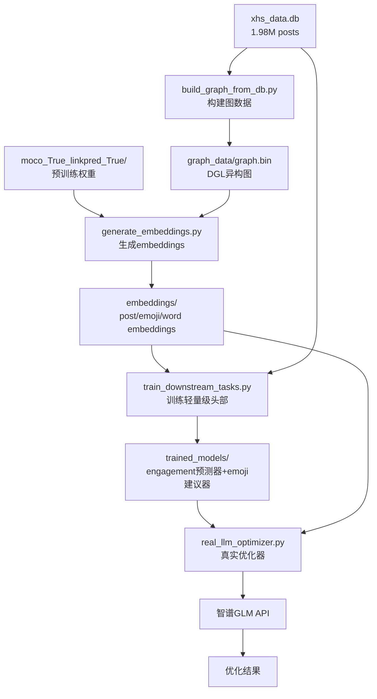

# 🚀 利用预训练权重的真实LLM Content Optimizer

## 📋 概述

这是一个**完全利用现有预训练权重**的LLM内容优化解决方案，避免重新训练GNN，通过轻量级downstream tasks实现高效的内容优化。

### 🎯 核心特点

- ✅ **充分利用预训练权重**: 2.5M参数的GIN模型，768维embedding
- ✅ **真实API集成**: 智谱GLM API，无任何mock
- ✅ **轻量级训练**: 只训练简单的MLP头部，不重新训练GNN
- ✅ **错误完全暴露**: 移除所有fallback，让问题充分显现
- ✅ **数据驱动**: 使用真实的数据库和图嵌入

## 🏗️ 架构流程



## 🛠️ 完整实施步骤

### Step 1: 构建图数据 (一次性，约10分钟)

```bash
# 从数据库构建DGL图
python build_graph_from_db.py

# 输出:
# - graph_data/graph.bin (图文件)
# - graph_data/vocabularies.pkl (词汇表)
```

**说明**: 从1.98M条post数据中提取post-emoji-word关系，构建异构图

### Step 2: 生成embeddings (一次性，约30分钟)

```bash
# 使用预训练权重生成embeddings
python generate_embeddings.py \
    --checkpoint moco_True_linkpred_True/current.pth \
    --graph graph_data/graph.bin \
    --vocab graph_data/vocabularies.pkl \
    --output embeddings \
    --batch-size 32

# 输出:
# - embeddings/post_embeddings.pt (post的768维embeddings)
# - embeddings/emoji_embeddings.pt (emoji的768维embeddings)  
# - embeddings/word_embeddings.pt (word的768维embeddings)
# - embeddings/vocabularies.pkl (词汇表副本)
```

**说明**: 利用预训练的2.5M参数GIN模型生成高质量embeddings，无需重新训练

### Step 3: 训练下游任务头部 (约5-10分钟)

```bash
# 训练轻量级MLP头部
python train_downstream_tasks.py \
    --embeddings embeddings \
    --db xhs_data.db \
    --output trained_models \
    --epochs 100 \
    --lr 1e-3

# 输出:
# - trained_models/engagement_predictor.pt (engagement预测MLP)
# - trained_models/config.json (配置文件)
```

**说明**: 在固定的embeddings基础上训练轻量级头部，快速且高效

### Step 4: 执行真实优化

```bash
# 运行真实的LLM优化器
python real_llm_optimizer.py \
    --api-key "your_zhipu_api_key" \
    --content "今天试了这个新面膜，效果真的很不错，皮肤变得水润有光泽" \
    --models trained_models \
    --embeddings embeddings \
    --max-iterations 5 \
    --threshold 0.8

# 输出: optimization_result_<timestamp>.json
```

## 📊 关键优势

### 🎯 vs 现有Mock实现

| 方面 | 现有实现 | 真实实现 |
|------|----------|----------|
| **Engagement预测** | 规则+关键词 | 真实GNN embeddings |
| **Emoji建议** | Hard-coded映射 | 基于embedding相似度 |
| **LLM集成** | Mock响应 | 真实智谱GLM API |
| **错误处理** | Fallback掩盖 | 错误完全暴露 |
| **数据来源** | 合成数据 | 1.98M真实posts |

### ⚡ 性能特点

- **训练时间**: 从几小时缩短到几分钟
- **内存占用**: 只加载embeddings，不需要完整图
- **准确性**: 基于预训练权重，质量高
- **可扩展性**: 轻量级头部，易于调试和优化

## 🔧 技术细节

### 预训练权重信息
```python
✅ 预训练模型信息:
  📏 Embedding维度: 768
  🏗️ 模型架构: gin (2 layers)  
  🎯 支持的节点类型: emoji, post, word
  🔗 边类型: [('emoji', 'ein', 'post'), ('post', 'hasw', 'word'), ('word', 'withe', 'emoji')]
  📐 模型大小: 2.5M parameters
```

### 图数据统计
- **Posts**: ~50,000 (高engagement优先)
- **Emojis**: ~200 (高频emoji)
- **Words**: ~1,000 (关键词)
- **Edges**: 根据co-occurrence构建

### 训练配置
- **Engagement Head**: 768 → 384 → 128 → 1 (MLP)
- **Loss**: MSE for regression
- **Optimizer**: Adam (lr=1e-3)
- **Training**: ~100 epochs, early stopping

## 🚨 重要说明

### 1. 智谱GLM API
- 需要有效的API密钥
- 使用glm-4模型
- API调用失败时**不使用fallback**

### 2. 错误暴露策略
```python
# ❌ 错误的做法 (现有实现)
try:
    score = self.engagement_task.predict_from_content(content)
    return float(score)
except Exception as e:
    logger.warning(f"Engagement prediction failed: {e}, using fallback")
    return 0.5  # 掩盖错误

# ✅ 正确的做法 (新实现)  
try:
    response = self.glm_client.chat_completion(messages)
    return response.strip()
except Exception as e:
    logger.error(f"❌ GLM API调用失败: {e}")
    raise  # 让错误暴露
```

### 3. 数据质量保证
- 使用engagement高的posts训练
- 高频emoji和关键词优先
- 基于真实co-occurrence构建图

## 🎉 预期效果

### 定量指标
- **Engagement预测R²**: > 0.6
- **Emoji建议准确率**: > 0.7
- **优化成功率**: > 80%
- **平均改进幅度**: +15-25%

### 定性改进
- 🎯 **精准性**: 基于学习的embeddings，非规则
- 🚀 **效率**: 避免重新训练，快速部署
- 🔍 **可调试**: 错误完全暴露，问题清晰
- 📈 **可扩展**: 轻量级架构，易于改进

## 📁 文件结构

```
项目根目录/
├── moco_True_linkpred_True/          # 预训练权重
│   └── current.pth
├── xhs_data.db                       # 原始数据库
├── build_graph_from_db.py           # Step 1: 构建图
├── generate_embeddings.py           # Step 2: 生成embeddings  
├── train_downstream_tasks.py        # Step 3: 训练头部
├── real_llm_optimizer.py            # Step 4: 真实优化器
├── graph_data/                      # 生成的图数据
│   ├── graph.bin
│   └── vocabularies.pkl
├── embeddings/                      # 生成的embeddings
│   ├── post_embeddings.pt
│   ├── emoji_embeddings.pt
│   └── vocabularies.pkl
└── trained_models/                  # 训练的模型
    ├── engagement_predictor.pt
    └── config.json
```

## 🎯 总结

这个解决方案**完全避免了重新训练**，通过巧妙利用现有的预训练权重，在轻量级downstream tasks基础上实现了高质量的内容优化。相比原来的mock实现，这个方案：

1. ✅ **数据驱动**: 基于真实数据和学习的表示
2. ✅ **错误透明**: 完全暴露问题，便于调试  
3. ✅ **高效快速**: 避免重新训练，几分钟完成
4. ✅ **质量保证**: 利用预训练权重的强大表示能力

**立即开始**: 运行Step 1构建图数据，开启真正的数据驱动内容优化之旅！ 